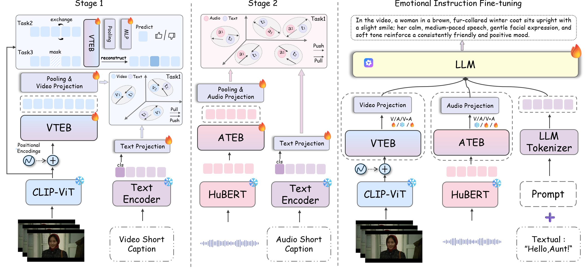

# XEmoGPT: An Explainable Multimodal Emotion Recognition Framework with Cue-Level Perception and Reasoning



## 🧩 环境配置

**第一步：创建 Conda 环境**

```bash
conda env create -f environment.yaml
conda activate XEmoGPT
````

**第二步：下载模型并配置路径**

- **Qwen3-4B**
    - 配置路径：`eval_configs/inference_config.yaml`
    - 链接：[https://huggingface.co/Qwen/Qwen3-4B](https://huggingface.co/Qwen/Qwen3-4B)

- **chinese-hubert-large**
    - 配置路径：`inference.py`
    - 链接：[https://huggingface.co/TencentGameMate/chinese-hubert-large](https://huggingface.co/TencentGameMate/chinese-hubert-large)

- **LaBSE**
    - 配置路径：`inference.py`
    - 链接：[https://huggingface.co/sentence-transformers/LaBSE](https://huggingface.co/sentence-transformers/LaBSE)

- **clip-vit-large-patch14**
  - 配置路径：`inference.py`
  - 链接：[https://huggingface.co/openai/clip-vit-large-patch14](https://huggingface.co/openai/clip-vit-large-patch14)

**第三步：下载模型权重（checkpoint）**

- 配置路径：`eval_configs/inference_config.yaml`
  - 链接：xxx


---

## 🎬 如何进行推理

在终端运行以下命令，指定视频路径、音频路径和字幕路径：

```bash
python inference.py \
  --cfg-path eval_configs/inference_config.yaml \
  --video-path [your video path] \
  --audio-path [your audio path] \
  --subtitle [your subtitle file]
```

---

## 📐 EmoCue-360 评估指标

### 模型下载

- **all-MiniLM-L6-v2**
  - 配置路径：`EmoCue-360/compute_prf.py`
  - 链接：[https://huggingface.co/sentence-transformers/all-MiniLM-L6-v2](https://huggingface.co/sentence-transformers/all-MiniLM-L6-v2)

### 使用流程

#### Step 1: 抽取情感线索（extract\_clue.py）

```python
INPUT_PATH = "/your/path/to/final-EMER-reason.csv"
emer_dict = pd.read_csv(INPUT_PATH).set_index('name')['english'].to_dict()
result = extract_vae_clue_from_dict(emer_dict)

OUTPUT_PATH = "/your/path/to/output.json"
save_dict_to_json(result, OUTPUT_PATH)
```

#### Step 2: 计算PRF指标（compute\_prf.py）

```python
MODEL_PATH = "/your/path/to/all-MiniLM-L6-v2"
model = EmoCue360(MODEL_PATH)

emer_gt_dict = load_json_to_dict("/your/path/to/EMER_clue.json")
rf_dict_xemogpt_emer = load_json_to_dict("/your/path/to/xemogpt_clue.json")

print("Visual: ", model.compute_visual_prf(rf_dict_xemogpt_emer, emer_gt_dict))
print("Auditory: ", model.compute_auditory_prf(rf_dict_xemogpt_emer, emer_gt_dict))
print("Global: ", model.compute_emotional_prf(rf_dict_xemogpt_emer, emer_gt_dict))
```

---

## 📂 EmoCue 数据集下载

- **EmoCue-Instruct**
  - 基于 MER-Caption+ 精细标注，仅提供标注文件，音视频文件参考 [MER2025](https://huggingface.co/datasets/MERChallenge/MER2025)
  - 链接：[https://pan.baidu.com/s/1JZ7CbXnsfEUMW0jwdEXzUA?pwd=9rh2](https://pan.baidu.com/s/1JZ7CbXnsfEUMW0jwdEXzUA?pwd=9rh2)

- **EmoCue-ShortCaption**
  - 基于 [DFEW](https://dfew-dataset.github.io/download.html) 和 MER2025，仅提供注释文件
  - 链接：[https://pan.baidu.com/s/1PyQ_LqfOM9_ZpRBWSna6Hw?pwd=4xi7](https://pan.baidu.com/s/1PyQ_LqfOM9_ZpRBWSna6Hw?pwd=4xi7)

- **EmoCue-Eval**
  - 评估集，基于 MER2025 原始视频，仅提供注释文件
  - 链接：[https://pan.baidu.com/s/1hf7G_DkttPmqVaA6Vtu8_Q?pwd=6d75](https://pan.baidu.com/s/1hf7G_DkttPmqVaA6Vtu8_Q?pwd=6d75)
